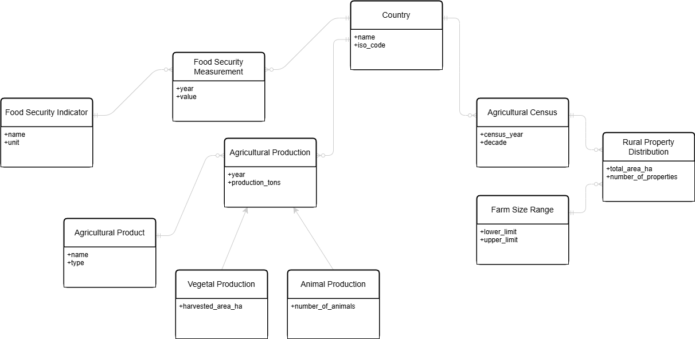
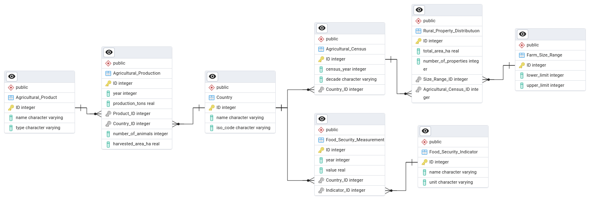

# MC536: Database Project - Agricultural Production, Land Use, and Food Security Analysis

## Project Overview
This project was developed by
<br/>[Lucas G. Bussinger da Silva](https://github.com/Lucas-Bussinger)
<br/>[Matheus F. Scatolin](https://github.com/Matheus-F-Scatolin)
<br/>[Rafael Setton A. de Carvalho](https://github.com/RafaelSetton)

This repository contains the coursework for **MC536: Databases - Theory and Practice**. The project involves designing, implementing, and querying a PostgreSQL database to analyze relationships between global agricultural production, agricultural land distribution (farm sizes), and food security indicators using open-source data.

## Database Schema Overview

The core of this project is the relational database designed to integrate the different datasets. Below are visualizations of the conceptual and relational models:

**Figure 1: Conceptual Model (ER Diagram)**
<p align="center">
  
</p>

**Figure 2: Relational (Logical) Model**
<p align="center">
  
</p>

*(The detailed Physical Model SQL script can be found [here](./models/Physical_model.sql)).*

---

## Table of Contents

- [Project Goals](#project-goals)
- [Datasets](#datasets)
  - [Original Data](#original-data)
  - [Preprocessed Data](#preprocessed-data)
- [Database Schema](#database-schema)
- [Technology Stack](#technology-stack)
- [Project Structure](#project-structure)
- [Setup and Usage](#setup-and-usage)
  - [Prerequisites](#prerequisites)
  - [Database Setup](#database-setup)
  - [Running the Code](#running-the-code)
- [Data Preprocessing](#data-preprocessing)
- [Analysis & Queries](#analysis--queries)
- [Results](#results)
- [License](#license)
- [Acknowledgements](#acknowledgements)

## Project Goals

*   Design a relational database schema (Conceptual, Logical, Physical models) to integrate data from diverse sources.
*   Implement the database schema in PostgreSQL.
*   Preprocess and clean the raw datasets for compatibility with the database structure.
*   Develop Python scripts using `psycopg2` within a Jupyter Notebook to:
    *   Create database tables.
    *   Load the preprocessed data from CSV files into the PostgreSQL database.
*   Execute meaningful, non-trivial SQL queries to explore potential correlations and insights regarding:
    *   Land concentration and food security.
    *   Staple crop production and dietary energy supply.
    *   Animal product production and protein supply.
    *   Trends over time for specific countries/products.
    *   Detailed land distribution profiles.

## Datasets

### Original Data

The raw data was sourced from FAOSTAT (Food and Agriculture Organization of the United Nations Corporate Statistical Database). The original files used for preprocessing are located in the `/datasets` directory:

*   `FAO_Structural_data_from_agricultural_censuses_3-21-2025.csv`: Contains data on farm structures, including size distributions, from various national agricultural censuses.
*   `FAO_Suite_of_Food_Security_Indicators_3-21-2025.csv`: Provides values for a wide range of food security indicators across countries and years.
*   `Production_Crops_Livestock_E_All_Data.csv`: Contains data on the production quantities (tons, number of animals) and area harvested for various crops and livestock products globally.

### Preprocessed Data

The original datasets were preprocessed (details in [`preprocessing.ipynb`](./preprocessing.ipynb)) to fit the designed database schema. The resulting cleaned CSV files, used for loading into the database, are located in the `/preprocessed_datasets` directory:

*   `agricultural_census.csv`: Contains combined census year, country, farm size range, number of properties, and total area data.
*   `production_crops_livestock.csv`: Contains production year, country, product details, production volume, harvested area, and animal counts.
*   `suite_of_food_security_indicators.csv`: Contains food security measurement year, country, indicator details, and measurement value.

## Database Schema

The database schema was designed through conceptual and logical modeling stages, resulting in the physical implementation in PostgreSQL.

*   **Conceptual Model:** [`/models/Conceptual_Model.png`](./models/Conceptual_Model.png)
*   **Relational (Logical) Model:** [`/models/Relational_Model.png`](./models/Relational_Model.png)
*   **Physical Model (SQL DDL):** [`/models/Physical_model.sql`](./models/Physical_model.sql)
*   **pgAdmin ERD File:** [`/models/project.pgerd`](./models/project.pgerd)

The main tables include:
*   `Country`: Stores country names and ISO codes.
*   `Agricultural_Product`: Stores agricultural product names and types (Vegetal/Animal).
*   `Food_Security_Indicator`: Stores food security indicator names and units.
*   `Farm_Size_Range`: Defines farm size brackets (lower/upper limits).
*   `Agricultural_Census`: Links country and year for specific census events.
*   `Rural_Property_Distribution`: Stores the number of properties and area per size range for a given census (Fact Table).
*   `Agricultural_Production`: Stores production volume/area/animal count per product, country, and year (Fact Table).
*   `Food_Security_Measurement`: Stores the value of a specific indicator for a country and year (Fact Table).

Foreign key relationships link the fact tables to the dimension tables.

## Technology Stack

*   **Database:** PostgreSQL (tested with version 14+)
*   **Language:** Python 3.x
*   **Libraries:**
    *   `psycopg2-binary`: PostgreSQL adapter for Python.
    *   `pandas`: Data manipulation and analysis (used in preprocessing and query result display).
    *   `jupyterlab` / `notebook`: For running the `.ipynb` files.
*   **Tools:** pgAdmin 4 (for database management and ERD generation)

## Project Structure
```bash
Postgres-Database-Project-FoodSecurity/
│
├── datasets/ # Original raw datasets from FAOSTAT
│ ├── FAO_Structural_data_from_agricultural_censuses_3-21-2025.csv
│ ├── FAO_Suite_of_Food_Security_Indicators_3-21-2025.csv
│ └── Production_Crops_Livestock_E_All_Data.csv
│
├── models/ # Database model files
│ ├── Conceptual_Model.png
│ ├── Physical_model.sql
│ ├── project.pgerd
│ └── Relational_Model.png
│
├── preprocessed_datasets/ # Cleaned CSV files ready for DB import
│ ├── agricultural_census.csv
│ ├── production_crops_livestock.csv
│ └── suite_of_food_security_indicators.csv
│
├── results/ # Output CSV files from analytical queries
│ ├── query_1_result.csv
│ ├── query_2_result.csv
│ ├── query_3_result.csv
│ ├── query_4_result.csv
│ └── query_5_result.csv
│
├── database_creation_and_queries.ipynb # Jupyter notebook for DB creation, data loading, and querying
├── preprocessing.ipynb # Jupyter notebook for preprocessing raw data (Optional to run)
└── README.md # This file
```

## Setup and Usage

### Prerequisites

1.  **Python 3.x:** Ensure Python 3 is installed.
2.  **PostgreSQL:** Install and run a PostgreSQL server (e.g., version 14 or higher).
3.  **pip:** Python package installer.
4.  **Required Python Libraries:** Install necessary libraries:
    ```bash
    pip install psycopg2-binary pandas jupyterlab "ipykernel>=6"
    ```
    *(Note: `ipykernel` needed for Jupyter)*
5.  **Clone Repository:** Clone this repository to your local machine.
    ```bash
    git clone <repository-url>
    cd Postgres-Database-Project-FoodSecurity
    ```
6.  **CSV Files:** Ensure the CSV files are present in the `/preprocessed_datasets` directory.

### Database Setup

1.  **Create Database:** Using `psql` or a tool like pgAdmin4, create a new PostgreSQL database. The default name used in the script is `mc536_project`.
    ```sql
    CREATE DATABASE mc536_project;
    ```
2.  **Configure Connection:** Open the [`database_creation_and_queries.ipynb`](./database_creation_and_queries.ipynb) notebook. Locate the database connection parameters near the beginning of the script and **update the `DB_PASS` variable** with your actual PostgreSQL password. Adjust other parameters (user, host, port, dbname) if necessary.

    ```python
    # --- Database Connection Parameters ---
    # !! IMPORTANT: Replace "pswd" with your actual PostgreSQL password !!
    DB_NAME = "mc536_project"
    DB_USER = "postgres"
    DB_PASS = "pswd" # <--- CHANGE THIS TO YOUR PASSWORD
    DB_HOST = "localhost"
    DB_PORT = "5432"
    ```

### Running the Code

1.  **Start Jupyter:** Navigate to the repository directory in your terminal and launch Jupyter Lab or Notebook:
    ```bash
    jupyter lab
    ```
    or
    ```
    jupyter notebook
    ```
2.  **Open Notebook:** Open the [`database_creation_and_queries.ipynb`](./database_creation_and_queries.ipynb) notebook in Jupyter.
3.  **Execute Cells:** Run the cells in the notebook sequentially.
    *   The notebook will first connect to the database.
    *   It will then execute the SQL DDL script to create the tables and constraints (using `IF NOT EXISTS` to be idempotent).
    *   Next, it will read data from the CSV files in the `/preprocessed_datasets` directory and load it into the corresponding database tables. Progress messages will be printed.
    *   Finally, it will execute the 5 predefined analytical SQL queries and display their results within the notebook (using pandas DataFrames).

## Data Preprocessing

The [`preprocessing.ipynb`](./preprocessing.ipynb) notebook details the steps taken to transform the original FAOSTAT CSV files into the simplified format used for database loading. This involved selecting relevant columns, renaming columns, handling missing values (where appropriate), and potentially filtering data. Running this notebook is optional if the files in `/preprocessed_datasets` are already present and deemed correct.

## Analysis & Queries

The core analysis is performed through SQL queries embedded within the [`database_creation_and_queries.ipynb`](./database_creation_and_queries.ipynb) notebook. Five non-trivial queries were designed to investigate relationships between the datasets, including:

1.  Land Concentration vs. Undernourishment Prevalence.
2.  Staple Crop Production vs. Dietary Energy Adequacy.
3.  Animal Product Production vs. Animal Protein Supply.
4.  Time-Series Trend Analysis (Example: Soya Production vs. Protein Supply in the USA).
5.  Detailed Land Distribution Profile for a specific Country/Census.

The SQL code for each query is documented within the notebook.

## Results

The output/results generated by executing the 5 analytical SQL queries in the main notebook are saved as CSV files in the `/results` directory for easy inspection:

*   [`query_1_result.csv`](./results/query_1_result.csv)
*   [`query_2_result.csv`](./results/query_2_result.csv)
*   [`query_3_result.csv`](./results/query_3_result.csv)
*   [`query_4_result.csv`](./results/query_4_result.csv)
*   [`query_5_result.csv`](./results/query_5_result.csv)

## Acknowledgements

*   Data provided by [FAOSTAT](https://www.fao.org/faostat/en/#home).
*   This project was developed as part of the MC536 course at unicamp.
