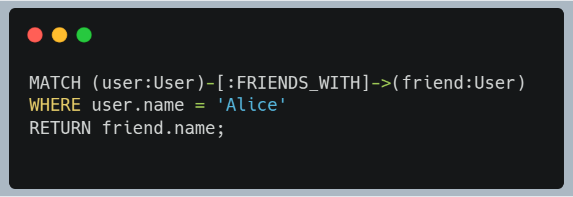

# Neo4j Analysis

Neo4j’s native graph architecture, Cypher query language, ACID properties, and operational robustness make it the ideal choice for Scenario C, which demands modeling, querying, and integrity of complex relationships.

## File Storage Method:

Neo4j stores data in a graph structure. Relationships, which are crucial for Scenario C, are represented as edges in the graph and can have their own attributes. Each relationship record contains pointers to the source node, the target node, and to the relationships of both nodes. This creates doubly linked lists of relationships per node, enabling extremely fast traversal between a node and its direct neighbors. During traversal, Neo4j follows these pointers directly, avoiding costly index lookups or joins like those in relational databases.

This storage model is highly beneficial for queries involving "multiple levels of connection" and "efficient navigation." The physical proximity of connected data minimizes computational cost and disk usage, directly supporting the performance demands of "deep relational queries."

## Query Language and Processing:

Cypher is a declarative graph-specific language designed to be intuitive for expressing relationship patterns. It uses a visual syntax with nodes () and relationships -->, [:TYPE]->. For example:
</img>

Cypher queries are transformed into execution plans. The engine begins with "anchor" nodes (found via indexes or labels) and traverses relationships by following pointers. This approach is highly efficient for traversals and pattern matching.
The traversal-optimized engine makes Neo4j ideal for the queries described in the scenario, especially those involving multiple levels of connection.

## Transaction Processing and Control:

Transactions can be explicit (BEGIN, COMMIT, ROLLBACK) or implicit (a single auto-committed query).
Full ACID support ensures strong consistency rules and relational integrity, which are essential for applications dealing with complex, interconnected data.

## Recovery Mechanisms:

- WAL (Write-Ahead Log): All changes are first written to the log before being applied to the database.
- Checkpoints: Data is periodically written to disk as consistent recovery points.
- Backup and Restore: Tools (neo4j-admin backup/restore) allow full or incremental backups, useful in major failure scenarios.

## Security Mechanisms:

- Authentication: Via username and password. LDAP/AD integration in the Enterprise edition.
- Authorization (RBAC): A detailed role-based permission model controlling read, write, traversal, schema modifications, etc.
- Encryption: Support for TLS/SSL and encryption at rest.
- Auditing: Logging of sensitive events (Enterprise).
