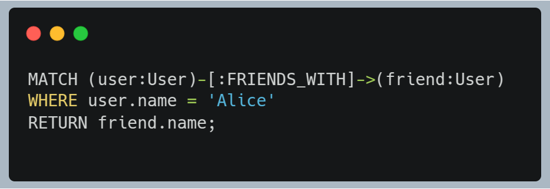

# Análise Neo4j

A arquitetura nativa em grafos do Neo4j, linguagem Cypher, propriedades ACID e robustez operacional o tornam a escolha ideal para o Cenário C, que exige modelagem, consulta e integridade de relacionamentos complexos.

## Forma de Armazenamento de Arquivos:

Neo4j armazena os dados na estrutura de um grafo. Os relacionamentos, fundamentais para o Cenário C, são representados como arestas do grafo, e podem possuir atributos próprios. Cada registro de relacionamento contém ponteiros para o nó de origem, o nó de destino e para os relacionamentos de ambos os nós. Isso cria listas duplamente encadeadas de relacionamentos por nós, permitindo uma travessia extremamente rápida entre um nó e seus vizinhos diretos. Durante a travessia, o Neo4j segue esses ponteiros diretamente, evitando buscas custosas em índices ou joins como nos bancos relacionais.
Esse modelo de armazenamento é altamente benéfico para consultas que envolvem "vários níveis de conexão" e "navegação eficiente". A proximidade física dos dados conectados minimiza o custo computacional e o uso de disco, atendendo diretamente às exigências de performance em "consultas relacionais profundas".

## Linguagem e Processamento de Consultas:

Cypher é uma linguagem declarativa específica para grafos, projetada para ser intuitiva ao expressar padrões de relacionamento. Usa uma sintaxe visual com nós `()` e relacionamentos `-->`, `[:TIPO]->`. Por exemplo:
</img>

As consultas Cypher são transformadas em planos de execução. O mecanismo começa com nós "âncora" (encontrados via índices ou rótulos) e percorre os relacionamentos seguindo os ponteiros. Essa abordagem é altamente eficiente para travessias e correspondência de padrões.
O motor otimizado para travessias tornam o Neo4j ideal para as consultas descritas no cenário, especialmente as que envolvem múltiplos níveis de conexão.

## Processamento e Controle de Transações:

Transações podem ser explícitas (`BEGIN`, `COMMIT`, `ROLLBACK`) ou implícitas (uma única consulta autocomitada).
Suporte total a ACID garante as regras de consistência fortes e integridade relacional, essenciais para aplicações que lidam com dados complexamente relacionados.

## Mecanismos de Recuperação:

- WAL (Write-Ahead Log): Todas as alterações são primeiro escritas no log antes de serem aplicadas ao banco.
- Checkpoints: Dados são periodicamente gravados no disco como pontos consistentes de recuperação.
- Backup e Restauração: Ferramentas (neo4j-admin backup/restore) permitem backups completos ou incrementais, úteis em falhas graves.

## Mecanismos de Segurança:

- Autenticação: Com nome de usuário e senha. Integração com LDAP/AD na edição Enterprise.
- Autorização (RBAC): Modelo detalhado de permissões por papéis, controlando leitura, escrita, travessias, modificações de esquema etc.
- Criptografia: Suporte a TLS/SSL e criptografia em repouso.
- Auditoria: Registro de eventos sensíveis (Enterprise).
